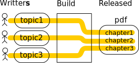

# Single Sourcing
----
### by
### David Roubinet , Apr16  
----

#### Presentation powered by reveal.js  
[home](..)

>>
# Introduction

* **Single sourcing** is about reusing the **same reference data**
* **Accross** different: tools, goals, people...
* Unleashes productivity with **real-time consistancy**

>>
# Why this training ?

* Moving to Single sourcing comes with many choices:

| |
|-|
| Data formatting |
| Data parsing |
| Data validation |
| Data injection |
| Data management |

vv
# Quizz

* This is a spread-sheet **seats in a theater**

|     |     |     |     |     |
|-----|-----|-----|-----|-----|
| #41 | #42 | #43 | #44 | #45 |
| #31 | #32 | #33 | #34 | #35 |
|  -  | #21 | #22 | #23 |  -  |
|  -  | #11 | #12 | #13 |  -  |
|  -  |  -  |  -  |  -  |  -  |
| -   | stage |  stage | stage | - |

* Where do you add an info : *seat broken* ?
vv
# Solutions

1. Colorize in red
 * How do you code *broken* and *bad view* ? red + bold ?
1. Insert a new row below every row
 * All parsers will need an update
 * The initial layout get lost as row are inserted
1. Place info on the side, and use conditional formatting
 * *Only* parsers that need the info, will need an update
 * Complexity increases on both spread-sheet and parser

> None of the above is scalable

> This is because the data is a **non hierarchical** matrix

>>
# &dArr; Formats &dArr;
vv
# XLS

| group  | name | age | phone |
|--------|------|-----|-------|
| rnd    | <span style="color:blue"> bob </span> | 35  |  '1234 |
|        | <span style="color:red" > zoe </span> | 37  |  '1246 |
| sales  | <span style="color:blue"> john</span> | 46  |  '1235 |

* **Cons**
  * No separation of data and style, <span style="color:blue">male</span> & <span style="color:red">female</span>  ?
  * No hierarchical access : coordinates only.
  * No built-in data mapping.
  * Reversed proprietary format.
  * Not version control friendly ( no easy diff ).
* **Pros**
  * Built-in data processing: sorting , filtering, plotting


vv
# CSV
```python
group,name,age,phone
rnd,bob,35,1234
,zoe,37,1246
sales,john,46,1235
```

* **Cons:**
  * Loosing types and style
  * Multi-line cells break most parsers
  * Many assumptions will be in scripts... escaping single sourcing
* **Pros:**
  * Simple scripting: grep & split

vv
# XML

```
<?xml version="1.0" encoding="UTF-8"?>
<db>
  <group name="rnd">
    <item name="bob"  age="35" phone="1234"/>
    <item name="zoe"  age="37" phone="1246"></item>
  </group>
  <group name="sales">
    <item name="john" age="46" phone="1235"/>
  </group>
</db>
```
* **Pro** Massively supported format
* **Con** Verbose, complex, limited to hierarchical untyped data
* **Ref** @ https://www.w3.org/TR/2006/REC-xml11-20060816
* **Try** @ http://codebeautify.org/xmlviewer#
* Created in 1998, works around pitfalls from the XXth : line endings, ascii
* Tags can follow a standard: `SVG, docbook, SPIRIT...`

vv
# JSON

```
{
  "rnd"    : {
    "bob"  : { "age":35, "phone":["1234","5678"]},
    "zoe"  : { "age":37, "phone":"1246"}
    },
  "sales"  : {
    "john" : { "age":46, "phone":"1235"}
    }
  }
```
* **Pro** Supports mappings, ordered arrays, and simple types: numbers
* **Con** Looks like python but is not. Example: `true` vs `True`, trailing commas
* **Ref** @ https://tools.ietf.org/html/rfc7159
* **Try** @ http://json.parser.online.fr/
* Taking over XML in websites for data exchange, language agnostic since 2013

vv
# YAML

```yaml
rnd:
  bob:  
    age:   35
    phone: ["1234","5678"]
  zoe:  
    age:    0x25
    phone:  &common "1246"
sales:
  john:
    age:    46
    phone:  *common # <- This will get "1246"
```
* **Pro** Human friendly and Powerfull
* **Con** Not native but libraries exist for all languages
* **Ref** @ http://yaml.org/
* **Try** @ http://yaml-online-parser.appspot.com/
* Created in reaction to complexity of XML, super-set of json since 2009

vv

# Data in SQL & al

* **Cons:**
  * Need fall-back format for off-line operations
  * Not version control friendly
  * Complex infrastructure
* **Pros:**
  * Massively multi-user  
vv
# Format Casting

* Loosless transitions


* How to read the graph?
  * All info from an XML can be written into a JSON
  * An XML can be writen with info coming from a JSON
  * But not all info contained in a JSON can be written into the XML

* Useful:
  * Python &#x27f7; json &#x27f7; *basic yaml*

vv
# Format Comparison

|                |      XLS     |      XML     |     JSON     |     YAML     |
|----------------|--------------|--------------|--------------|--------------|
| Nesting        | &#x2a2f;     | **&#x2713;** | **&#x2713;** | **&#x2713;** |
| Strings        | **&#x2713;** | **&#x2713;** | **&#x2713;** | **&#x2713;** |
| Mappings       |  &#x2a2f;    | **&#x2713;** | **&#x2713;** | **&#x2713;** |
| Ordering       | **&#x2013;** | &#x2a2f;     | **&#x2713;** | **&#x2713;** |
| Numbers        | **&#x2713;** | &#x2a2f;     | **&#x2713;** | **&#x2713;** |
| Hexadecimal    | **&#x2713;** | &#x2a2f;     | &#x2a2f;     | **&#x2713;** |
| References     | **&#x2713;** | &#x2a2f;     | &#x2a2f;     | **&#x2713;** |
| Human friendly | **&#x2713;** | &#x2a2f;     | **&#x2013;** | **&#x2713;** |

>>

# &dArr; Parsing &dArr;

vv
# Parsing XLS

> install `xlrd`

```python
from xlrd import open_workbook
wb = open_workbook("data.xls")
for sheet in wb.sheets():
  if sheet.name=="mySheet":
    for rowIndex in range(sheet.nrows):
        cells = sheet.row_values(rowIndex)
        if cells[1]=="zoe":
          print( "Zoe's phone: "+cells[3] )
```
Feasible, but breaks as row and columns are moved around
vv
# Parsing XML

```python
import xml.etree.ElementTree as ET
tree = ET.parse("data.xml")
for groups in tree.getroot():
    for item in groups:
        if item.attrib["name"]=="zoe":
            print( "Zoe's phone: " + item.attrib["phone"] )
```
Feasible

vv
# Parsing JSON

```python
import json
db =  json.load( open("data.json") )
print( "Zoe's phone: " + db["rnd"]["zoe"]["phone"])
```
Easy

vv
# Parsing YAML

> Install PyYAML

```python
import yaml
db=yaml.load( open("data.yaml") )
print( "Zoe's phone:" + db["rnd"]["zoe"]["phone"])

```
Easy, but not ( yet ) native

vv
# Parsing Comparison

|             |     XLS      |    XML       |   JSON       |   YAML   |
|-------------|--------------|--------------|--------------|----------|
| perl        | Spreadsheet  |     XML      |     JSON     |   YAML   |
| python      | xlrd         | **native**   | **native**   | pyyaml   |
| ruby        | spreadsheet  | **native**   | **native**   | **native**   |
| node,coffee,js| js-xls     | **native**   | **native**   | yaml.js  |
| Coder friendly | &#x2a2f; | &#x2a2f; | **&#x2713;** | **&#x2713;** |

>>
# &dArr; Validation &dArr;

vv
# Schema

A **schema** is a template describing:

||
|-|
|The hierachy of data  |`group->teams->(name,phone)` |
|The occurence of data |`at least 1`, `no more than 5`,... |
|The type of data      |`integer in the range 3 to 42` |

A **schema processor** can tell if a data file complies:

```
$ processor schema.xsd data.xml
Error! Attribute "age" missing for Bob
```
vv
# XSD

```
<?xml version="1.0"?>
<xsd:schema xmlns:xsd="http://www.w3.org/2001/XMLSchema">
  <xs:complexType>
    <xs:sequence>
      <xsd:element name="name" type="xsd:string"/>
      <xsd:element name="age"  type="xsd:positiveInteger"/>
    </xs:sequence>
  </xs:complexType>
</xsd:schema>
```
* **Con** Very complex to master and maintain
* **Pro** Mature
* **Ref** @ http://www.w3schools.com/xml/schema_example.asp

vv
# JSON schema

```
{
  "title": "Example Schema",
  "type": "object",
  "properties": {
    "name": {"type": "string"},
    "age" : {"type": "integer", "minimum": 0 }
  },
  "required": ["name", "age"]
}
```
* **Con** Not native but many libraries
* **Pro** Easy
* **Try** @ http://www.jsonschemavalidator.net/
* **Ref** @ http://json-schema.org/

vv
# YAML Schema

<pre><code style="font-family:monospace">type:       map
mapping:
 "name":
    type:      str
    required:  yes
 "email":
    type:      str
    pattern:   /@/
 "age":
    type:      int
 "birth":
    type:      date
</code></pre>

* **Con** Ruby only
* **Pro** Very easy
* **Ref** @ http://www.kuwata-lab.com

vv
# Schema Comparison

| XLS | XML     | JSON | YAML |
|-|
| N/A | Complex | &#x263A; Easy  | Ruby |

>>
# &dArr; Injection &dArr;
vv
# Directives

 1. **process includes**
 2. **search & replace defines**
 3. compile

Directive *ANDing*
```
`ifdef BIG
`ifdef RED
    something
```
Directive *ORing*
```
`ifdef BIG
     something
`ifdef RED
     something # Duplicate!
```
Need more horse power ?
vv
# Preprocessor

`source` -> **pyhp** -> `decompiled` -> **compile**

`source`:
```
Hello!
<%
for name in ["Bob","Zoe","John"]:
    print( "* to "+name )
%>
The end
```
`decompiled`:
```
Hello!
* to Bob
* to Zoe
* to John
The end
```
vv
# Templates

Multiline keyworded format strings...
```
tpl = """\
<group>
  <item>
    <name>%(name)s</name>
    <phone>%(phone)s</phone>
  </item>
</group>"""

data = {'name':'zoe', 'phone':'1234'}

print( tpl % data)
```
```
<group>
  <item>
    <name>zoe</name>
    <phone>1234</phone>
  </item>
</group>
```
vv
# Generator

```
import xml.etree.ElementTree as ET

data = {'name':'zoe', 'phone':'1234'}

root = ET.Element("root")
for key, val in data.items():
    child = ET.Element(key)
    child.text = str(val)
    root.append(child)

print( ET.tostring(root) )
```

```
<root><phone>1234</phone><name>zoe</name></root>
```

vv
# Polymorphism

### `MyHDL`

<pre><code style="font-family:monospace">from myhdl import *

def dff(q, d, clk):
  @always(clk.posedge)
  def logic():
    q.next = d
  return logic
</code> </pre>

### `Automatic Conversion`

<pre><code style="font-family:monospace">module dff (q, d, clk );
  output q;
  input d,clk;
  reg q;
  always @(posedge clk) begin: _dff_logic
      q <= d;
  end
endmodule
</code> </pre>

>>

# &dArr; Doc &dArr;
vv
# Build Doc ... Why?
**1** Multi Authors

**2** Multi Audiences

vv


`blabla.py`

```python
title("My topic")
p(tag="basic",txt="""
Bla bla
Bla bla
Bla bla
""")
p(tag="detail",txt="""
Bla bli Bla bli
Bla bli Bla bli
""")
```
>>
# &dArr;Revision Control&dArr;
vv
# History

| RCS |&rarr; CVS | &rarr; SVN |&rarr; GIT|&rarr;GitHub |&rarr;GitLab |
|-|
| 1982 | 1990 | 2000  | 2005| 2008 | 2013 |
| file | files | folders | branches | forks | intranet |
| coder | local team | remote team | worldwide team | anybody | company |
| &darr; DesignSync | &darr;ClearCase | - | - | - | - |

# Goal

* To reuse **=** Reference
* To reuse **&ne;** Copy & Paste

vv
# Source separation
Archive static snapshots

Keep source liteweight

Do not risk misaligned source vs build


vv

# Continuous Integration
Server Side build


