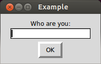

# More
### Enough background to launch a rocket
----
### by
### David Roubinet , Feb14  

----
#### Presentation powered by reveal.js  
[home](..)
>>
# Zen of python
`import this`

||
|----------------------|
|Beautiful is better than ugly. |
|Explicit is better than implicit. Simple is better than complex. |
|Complex is better than complicated. |
|Flat is better than nested. Sparse is better than dense. |
|Special cases aren't special enough to break the rules. |
|In the face of ambiguity, refuse the temptation to guess. |
|Now is better than never. |
|If the implementation is hard to explain, it's a bad idea. |
|If the implementation is easy to explain, it may be a good idea. |

*by Tim Peters*
>>
# Lists
Mapping, Comprehension

| Expression                   | Result          |
|------------------------------|-----------------|
| `zip(["A","B","C"],[17,23,47])`  |`[('A',17),('B',23),('C',47)]`|
|`[ 2*x+1 for x in [1,2,3,4] ]` |`[3, 5, 7, 9]`   |
|`[   x   for x in [1,2,3,4] if x%2==1 ]` |`[1, 3]`         |
| `[ x*y for x in [1,2,3] for y in [3,4]]`| `[3, 4, 6, 8, 9, 12]` |

vv
# Specialized lists

**Tuples:** immutable sequences
```python
>>> 1, # or (1,) coma is mandatory, parenthesis are optional
(1,)
>>> ("A","B","C",)[0:2]
('A','B')
>>> # ("A","B","C",)[0]='D' # Error !
```
**Sets:** unordered unique elements

| Expression                  | Result                     |
|-----------------------------|----------------------------|
| `set("ABCDABC")`            |`set(['A', 'C', 'B', 'D'])` |
| `set("ABCDABC")&set("DEF")` |`set(['D'])`                |
| `set("ABCD")[0]`            | *Error*                    |

>>
# Dictionaries
```python
mydict = {
	'keyword' : 'B',  # A string can be a key
	 67       : 'E' , # or integer
	(1,2)     : 'E'   # or a tuple
	myObj     : 'R'   # or anything providing a hash() method
}
```

Selection is based on hash() matching
```
>>>"ABC".__hash__()
826005955
```
vv
# Quiz
Is a list usable as a key ?
vv
# Answer
A list cannot be a key, as it cannot be hashable meaningfully

```python
>>> hash(tuple([1,2]))
1299869600
>>> hash([1,2])
Traceback (most recent call last):
  File "<stdin>", line 1, in <module>
TypeError: unhashable type: 'list'
```

> `mylist=["A","B"]`  
`hash(mylist)= hash([ pointer0, pointer1])`  
`mylist[0]="C"`   
`hash(mylist)` => **same result !**

>>
# Generators
`yield`
```python
def dataGen(seed,size): # <- First call starts here
    cnt = 0
    val = seed
    while cnt < size:
        val = (val*100)%(97)
        yield val              # if yield keyword => generator
        cnt += 1               # <- 2sd call starts here
```
```python
gen=dataGen(12,1000)
print gen.next(),
print gen.next(),
print gen.next()
```
> `36 11 33`  

```python
for data in dataGen(17,10): print data,
```  
> `51 56 71 19 57 74 28 84 58 77`
vv
# Quiz
Write a generator giving the color of a traffic light
vv
# Answer
```python
def trafficlight():
    while 1:
        yield "red"
    	yield "green"
    	yield "orange"

g1=trafficlight()
g2=trafficlight()
print g1.next(),
print g1.next(),
print g2.next(),
print g1.next()
```
> red green red orange
>>
# Objects
`class`
```python
class rect():

    def __init__(self,w,h): # A function in a class = method
        self.w=int(w)
        self.h=int(h)

    def area(self):    i
        return self.w*self.h
```
```python
>>> r1 = rect(5,3)
>>> print r1.area() # Call method with r1 as self
```
> `15`
vv
# Inheritance
```python
class square(rect): # <- Meaning: A square is a rectangle except ....

    def __init__(self,s):
        self.w = s
        self.h = s
```
```python
>>> sq1=square(12)
>>> print sq1.area()
```
> 144
vv

# Magic Methods

```python
    ...
    def __repr__(self): return ("*"*self.w +"\n")*self.h

    def __iter__(self):
        for y in range(self.h):
            for x in range(self.w):
                 yield x,y
```

```python
>>> print r1
+++++  
+++++  
+++++  
>>> for x,y in r1: print "%r:%r"%(x,y),  
0:0 1:0 2:0 3:0 4:0 0:1 1:1 2:1 3:1 4:1 0:2 1:2 2:2 3:2 4:2
```
`+` &rarr; `__add__()`,   
`in` &rarr; `__contain__()`  
...
>>
# Exceptions
`try` &rarr; process error

```python
try:
    f = file("filename.txt")
except:
    raise SystemError,"Sorry file not found"
```

`with` &rarr; auto-clean on error

```python
with open("filename.txt") as f:
    for line in f: # f will be closed on exception
       ...
```

>>
# Module
Built-in `make` mechanism

`import foo`  

> 1. Tries to find an up-to-date byte-code `foo.pyc`  
1. Else generates the byte-code from `foo.py`   
1. Keep it for later in `foo.pyc`
1. Executes byte-code  

`file.pyc`

> portable , but for a given python revision x.y

vv

# Byte-code

```python
code_src = """
x = 23
print x + 17
"""
code_obj = compile(code_src,'<string>','exec')
exec code_obj
```
**The real thing**: `str(code_obj.co_code)`

`'d\x00\x00Z\x00\x00e\x00\x00d\x01\x00\x17GHd\x02\x00S'`

**Disassembled**:`dis.dis(code_obj)`
```
  2           0 LOAD_CONST               0 (23)
              3 STORE_NAME               0 (x)
  3           6 LOAD_NAME                0 (x)
              9 LOAD_CONST               1 (17)
             12 BINARY_ADD          
             13 PRINT_ITEM          
             14 PRINT_NEWLINE       
             15 LOAD_CONST               2 (None)
             18 RETURN_VALUE        
```
>>
# Gui

Native, legacy of tcl-tk  

`import Tkinter as tk`  



```python
def dialog(gui) :    
    gui.geometry('200x100')
    gui.title('Example')
    gui.zone = tk.Frame(gui, padx=10, pady=10)
    gui.zone.pack(fill=tk.BOTH, expand=True)
    tk.Label(gui.zone, text="Who are you:").pack(side=tk.TOP)
    gui.User = tk.Entry(gui.zone, width=16)
    gui.User.pack(side=tk.TOP, padx=10, fill=tk.BOTH)
    ok = tk.Button(gui.zone, borderwidth=4, text="OK")
    ok["command"]= lambda : gui.quit()
    ok.pack(side=tk.BOTTOM)

    gui.User.focus_set()
    gui.mainloop()
```

```python
gui=tk.Tk()
dialog(gui) #<- blocked here until OK
print gui.User.get()
```

vv

## Advanced

* Qt ( wrapped )
* Not sure web front-end vs desktop ?
 * `pyjamas`

>>
# Sockets

`import socket`

> `server.py`

```python
s = socket.socket()         
s.bind((socket.gethostname(), 12345))
s.listen(5) # Now wait for client connection.
while True:
   c, addr = s.accept() # Establish connection with client.
   print 'Got connection from', addr
   c.send('Thank you for connecting')
   c.close()            # Close the connection
```

> `client.py`

```python
mysocket = socket.socket()
mysocket.connect((socket.gethostname(), 12345))
print mysocket.recv(1024)
mysocket.close
```

>>

# Server

Web server for static files
> `python -m SimpleHTTPServer`

Application servers
> `web.py, cherry.py, flask.py, bottle.py`

```python
from bottle import default_app, route

@route('/static/<filepath:path>')
@route('/static')
def serve_this_folder(filepath="index.html"):
    return static_file(filepath,root=__file__+"../path/to/folder")

@route('/data')
def sendData(): # <- The dictonary will be sent as json :)
    return { "colors"  : ["blue",  "red",   "green"],
             "animals" : ["snake", "fox",   "dog"],
             "fruits"  : ["banana","orange","kiwi"], }
```
vv

# On-line functions
Server

```python
from SimpleXMLRPCServer import *

class My_Web_Service:
    def __init__(self): pass
    def add(self, x, y): return x + y
    def mul(self, x, y): return x * y

if __name__ == "__main__":
    server = SimpleXMLRPCServer(("localhost", 8080))
    server.register_instance(My_Web_Service())
    server.serve_forever()
```

Client

```python
import xmlrpclib
server = xmlrpclib.Server('http://localhost:8080')
print server.add(3, 4)
print server.mul(3, 4)
```

vv

# Http**s**

`urllib2`

password manager, attached to an url stub

```python
rooturl  = 'https://myserver/mysite'
username = 'myname'
password = '******' # Get it from a cache or a gui

import urllib2
passman = urllib2.HTTPPasswordMgrWithDefaultRealm()
passman.add_password(None, rooturl, username, password)
authhandler = urllib2.HTTPBasicAuthHandler(passman)
opener  = urllib2.build_opener(authhandler)
urllib2.install_opener(opener)

page = urllib2.urlopen(rooturl+'/this/page.html')
```
>>
# 2 vs 3

| !!! Syntax **Not** backward compatible !!! |
|--|
| |

# 2 to 3

 ```$ 2to3 -w myscript.py```

| 2.x &rarr;| 3.x |
|-----|------|
|`print "ABC",` |`print("ABC",end=" ")` |
| `import Queue` | `import queue` |
| `import SimpleHTTPServer` | `import http.server` |
| `while 1:` | `while True:` |
| `import package` | `from . import package` |

>>
# Extending

`disutils` &rarr; install

> download new package  
> install it: `( sudo ) python setup.py install`

`pip` &rarr; package manager

> download `get-pip.py`  
> install: `python get-pip.py`    
> usage:  
> &bullet; `pip install requests`  
> &bullet; `pip search xml`  
> &bullet; `pip show beautifulsoup4`  
> &bullet; `pip uninstall requests`  

>>
# Wrapping C

## swig + disutil

| Steps                       | Generated Files        |
|-----------------------------|------------------------|
| original project            | `foo.c`,`foo.h`        |
| Make a swig control file ( get example.i ) | `foo.i` |
| `$ swig -python foo.i`      | `foo_wrap.c`           |
| Make a disutil control file ( get a template ) | `setup.py` |
| `$ python setup.py build_ext --inplace` | `_foo.so(pyd)`,`foo.py` |  

```python
import foo
foo.myfunc()
```

>>

# Wrapping Shared Libs
`import ctypes`

```python
import ctypes
from ctypes.util import find_library

ssl    = ctypes.CDLL(find_library('ssl'))           # Loading *.so,*.dll
key    = ctypes.create_string_buffer(255)           # Declaring char[255]
ssl.DES_string_to_key("12345678",ctypes.byref(key)) # i.e. byref = &key
```
```python
print ssl._name
print '12345678'.encode('hex')
print key.value.encode('hex')
```
> `libssl.so.1.0.0`  
> `'3132333435363738'`  
> `'8a626479a1160291'`
>>

# SQL & al

Interface @ `code.google.com/p/pyodbc`

`import pyodbc`

```python
cnxn = pyodbc.connect(
            driver='{SQL Server}',
            server='localhost',
            database='test',
            uid='me',
            pwd='me2')
cursor = cnxn.cursor()
```

```python
for row in cursor.execute("""
    select user_id, user_name
        from users
            where last_logon < ?
                and bill_overdue = ?
    """,
    '2001-01-01', 'y'):

    print row.user_id, row.user_name
```

>>
# Plots

`www.matplotlib.org`, visit on-line [gallery](http://matplotlib.org/gallery.html)


```python
from pylab import *
t = arange(0.0, 2.0, 0.01)
s = sin(2*pi*t)
plot(t, s)
xlabel('time (s)')
ylabel('voltage (mV)')
title('About as simple as it gets, folks')
grid(True)
savefig("test.png")
show()
```
>>
# PDF
`http://www.reportlab.com`, visit on-line [samples](http://www.reportlab.com/software/opensource/samples/alabama-state-education-reports)


Full stack:  

 * Low level primitives: `labels`,`lines`,`images` &rarr; templates  
 * High level primitives: `charts` &rarr; data driven images  
 * Text flow: `title`,`chapters` &rarr; toc, pagination  
 * Mix: `python`+blabla &rarr; loops, import csv, variables....  

>>
# SmartCards

`http://pyscard.sourceforge.net`, visit on-line [user guide](http://pyscard.sourceforge.net)  
Stacks over PCSC(lite)

```python
>>> from smartcard.System import readers
>>> from smartcard.util import toHexString
>>>
>>> r=readers()
>>> print r
['SchlumbergerSema Reflex USB v.2 0', 'Utimaco CardManUSB 0']
>>> connection = r[0].createConnection()
>>> connection.connect()
>>> SELECT = [0xA0, 0xA4, 0x00, 0x00, 0x02]
>>> DF_TELECOM = [0x7F, 0x10]
>>> data, sw1, sw2 = connection.transmit( SELECT + DF_TELECOM )
>>> print "%x %x" % (sw1, sw2)
9f 1a
>>>
```

>>
# Lab

## Hangman game

1. **A word server**  
   1. Builds a collection of 8-letter words from an on-line book/article.
   1. Acts as a remote generator and gives one word on demand.

1. **A game server**  
   1. Get a new word from word server on new game request
   1. Give a feedback on letter proposal
   1. Give a score on word proposal

1. **A game client**  
   1. Gui with proposal entry and text zone
   1. Display current guess status in text zone

vv

* Ready to look at ** &darr; &darr; solution &darr; &darr; **

vv

# Word server

```python
import SimpleXMLRPCServer
import urllib
import re

class wordGen:
    def __init__(self):    
        url = "http://www.gutenberg.org/files/44955/44955-h/44955-h.htm"
        txt = urllib.urlopen(url).read()
        words = re.findall(r'\b[a-zA-Z]{8}\b',txt,re.M)
        words = [word.lower() for word in words ]
        self.words = set(words)
        print "Ready with %d words in stock"%(len(words))
    def next(self):
        if not self.words: self.__init__()
        return self.words.pop()
```

```python
if __name__ == "__main__":
    server = SimpleXMLRPCServer.SimpleXMLRPCServer(("localhost", 8080))
    server.register_instance(wordGen())
    server.serve_forever()
```

vv

# Game server

```python
import SimpleXMLRPCServer
import xmlrpclib
class hangMan:
    def __init__(self):    
        self.wordServer  = xmlrpclib.Server('http://localhost:8080')
        self.secret = self.wordServer.next()
    def new(self):
        self.secret = self.wordServer.next()
        return True
    def guess(self,propal):
        if   len(propal)==1:
            return [i for i,c in enumerate(self.secret) if c==propal]
        elif len(propal)==8: return propal==self.secret
        else               : return -1
```

```python
if __name__ == "__main__":
    server = SimpleXMLRPCServer.SimpleXMLRPCServer(("localhost", 8081))
    server.register_instance(hangMan())
    server.serve_forever()
```  
vv
# Game Client
## Call-backs
```python
import Tkinter as tk
import xmlrpclib

def new():
    server.new()
    guess.set("-"*8)
```

```python
def submit():
    propalValue = propal.get()
    result=server.guess(propalValue)
    if len(propalValue)==1:
        letters=list(guess.get())
        for index in result: letters[index]=propalValue
        guess.set("".join(letters))
    else:
        if result: message = "Congrats"
        else:      message = "No luck"
        guess.set(message)
```

vv

# Game Client cont'd
## Main loop

```python

server = xmlrpclib.Server('http://localhost:8081')

gui=tk.Tk()
propal = tk.StringVar()
guess  = tk.StringVar()
guess.set("-"*8)

tk.Label( gui,text="1 Letter or 8-letter word:").pack()
tk.Entry( gui,textvariable=propal              ).pack()
tk.Label( gui,textvariable=guess               ).pack()
tk.Button(gui,text="Submit",command=submit     ).pack()
tk.Button(gui,text="New",command=new           ).pack()

gui.mainloop()

```
